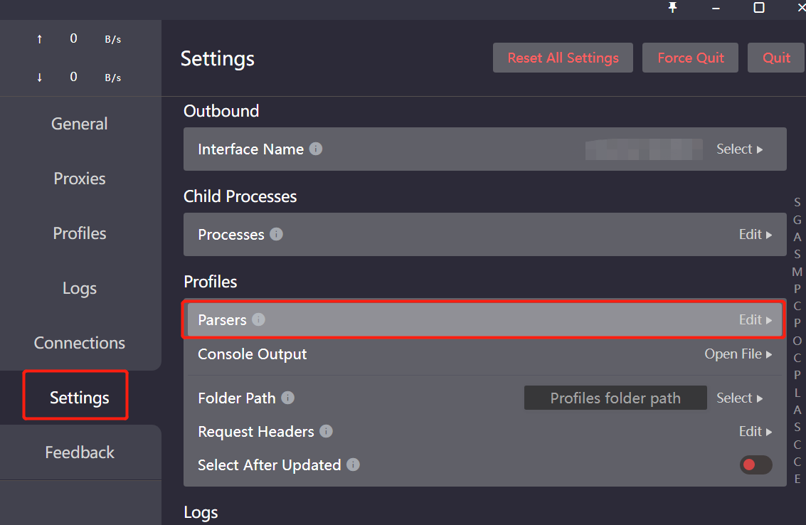

+++
title = "clash订阅在更新时注入自己的规则"
date = 2023-07-21T22:37:10+08:00
updated = 2026-01-10T10:05:09+08:00
path = "2023/07/21/clash-parsers"

[taxonomies]
tags = ["教程"]
+++

> clash的规则模式, 确实是很多人心中的理想功能, 但是加入我们身处网络环境复杂, 想自定义修改这个规则, 就会发现修改后, 订阅更新, 会覆盖掉你自定义的规则, 所以需要在更新后重新注入自定义的规则.

首先, 在CFW(clash for windows)中找到设置项:



随后在编辑界面输入:

```yaml
parsers: # array
  - reg: ^.*$
    yaml:
      prepend-proxy-groups: # 建立策略组
        - name: 策略组名
          type: select
          proxies:
            - DIRECT # 可以选择的代理
      prepend-rules:
        - DOMAIN-SUFFIX,beisen.cn,策略组名
```

tips: 理论上只要写入 parsers 文件, 再次去刷新订阅的时候, 就可以发现规则界面多出的策略, 但实测发现不行, 发现应该[是用VScode编辑器而不是自带的 __](https://github.com/Fndroid/clash_for_windows_pkg/issues/2250)(yml文件格式问题)

最后, 贴一下clash官网对这部分的[文档 __](https://docs.cfw.lbyczf.com/contents/parser.html)
