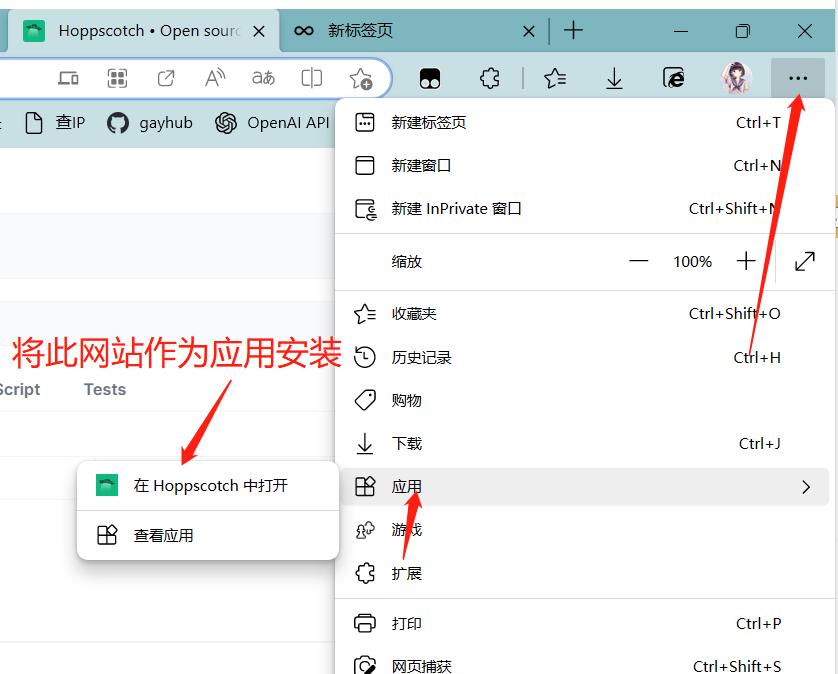
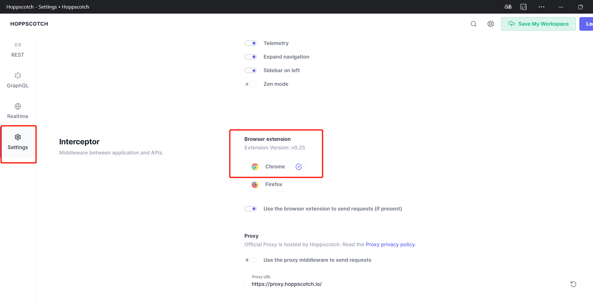

今天分享一款轻量级的发送Http请求的软件: 

github: [hoppscotch __](https://github.com/hoppscotch/hoppscotch)

在线地址: [https://hoppscotch.io/ __](https://hoppscotch.io/)

 然后就安装成功了, 进来在设置一下让他走我们的浏览器插件 edge也是Chrome

平时一直用, 因为比较小, 启动很快, 复杂的可以用 Postman 或者 Fiddler.

hoppscotch其实也可以部署在自己电脑上, 但是感觉比较麻烦, 用浏览器插件,然后在线使用, 个人体验还不错.
