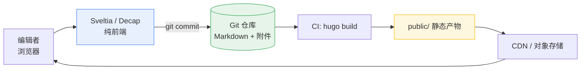

用 Hugo 写博客的人，几乎都会走到同一步：**想让不熟 Git 的人也能写文章**。于是 CMS 被接了进来。

但 CMS + Hugo 不是免费午餐。它把"写 Markdown"这件极简的事，变成了"配置 schema + 走一遍 CI"。这篇文章不站队，只把两边的账都算清楚。

## 一句话结论

> Hugo + CMS 适合**以内容为主、变更频率不高、追求极致加载性能和极低运维成本**的站点。
> 如果你需要**实时协作、多人多地同时编辑、复杂工作流（审核、定时发布、多语言联动）**，那么传统动态 CMS 加一层 CDN 往往更划算。

---

## 方案全貌：CMS 到底接在哪一层

讨论优缺点之前，得先分清三类完全不同的"接法"。它们的代价天差地别。

### 1. Git-based CMS：仓库即数据库

代表：**Decap CMS（原 Netlify CMS）**、**Sveltia CMS**、**Keystatic**。

CMS 只是一个纯前端编辑器，它把表单数据序列化回 Git 仓库，触发 CI 重新构建。



> [!NOTE] 本站用的就是这个
> 本博客的 `config/_default/params.yml` 里配置了 `headless_cms.engine: sveltia`，内容写回 `define9/define9.github.io`，而 `path: '{{slug}}/index'` 这一行决定了每篇文章的落盘路径是 `content/posts/<slug>/index.md` —— 也就是 **Hugo Leaf Bundle**。CMS 表单和 Git 目录结构在这里是一一对应的。

### 2. API-based CMS：独立内容服务

代表：**Contentful**、**Sanity**、**Strapi**（自托管）、**Directus**。

CMS 有自己的数据库和管理后台，Hugo 通过远程数据源（`.Params` 替换成远程 API 调用）在构建时拉内容。Hugo 在这里**只负责渲染**，内容完全脱离仓库。

### 3. 本地/云端文件编辑器

代表：**Keystatic**（本地 Git）、**CloudCannon**、**TinaCMS**（可视化拖拽 + Git 同步）、**Decap** 的自建版本。

介于前两者之间：内容仍落在 Git 里，但编辑体验更接近 Notion，有可视化页面构建器。

---

## 优点

### 1. 部署与运维成本近乎为零

最终产物是一堆 `.html`、`.css`、`.js`。扔到 GitHub Pages、Cloudflare Pages、Netlify、Vercel 乃至任意对象存储都行。

- 没有 PHP / Node 运行时，没有数据库要备份
- 挂了只可能是 CDN 问题，而 CDN 的可用性通常是 99.99%
- 一年托管账单可能是 **0 元**（静态托管免费额度足够个人博客）

对比一下 WordPress 站点：为了安全更新要盯着几十个插件，为了性能要装缓存插件，为了备份要再买一个服务器。

### 2. 安全性是"结构性的"，不是"补丁堆出来的"

静态站点**没有运行时攻击面**。SQL 注入、XSS 反射、文件上传漏洞、RCE —— 这些漏洞类别在静态站点上根本不存在，因为没有执行这些代码的服务端。

> [!WARNING] 注意
> 静态不等于免疫。评论系统、搜索服务、CMS 本身如果部署在同域下，仍然是攻击面。**CMS 后台一定要放在独立域名 + 基本认证后面**，别和站点主域共享 cookie 作用域。

### 3. 内容即代码：Git 免费送你的超能力

这是 Git-based CMS 最大的隐藏收益。

- **历史记录 / 回滚**：每篇文章的每一版都在 `git log` 里，回退就是一次 `git revert`
- **Diff 可读**：有人把结论从"3 天"改成"5 天"，review 时一眼看得出
- **Code Review**：PR + review 流程天然适配，一篇文章可以先看再发
- **可迁移**：格式是开放的 Markdown + YAML，换 CMS、换主题、换托管，文章一个字都不用改
- **全文搜索与 grep**：`rg "性能" content/` 一秒定位

### 4. Leaf Bundle 让"文章 + 资源"成为一个原子单元

Hugo 的 **Leaf Bundle** 是单篇文章最舒服的组织方式：文章、封面图、附件、配套的短代码，全部住在同一个目录里。

```text
content/posts/hugo-cms/
├── index.md        # 文章正文，front matter + markdown
├── cover.jpg       # 封面图
├── diagram.svg     # 插图
└── data.csv        # 配套数据文件，模板里可以直接读
```

模板里通过 `.Resources` 拿资源，通过 `.Data` 读配套数据文件。这解决了一个长期困扰 Markdown 博客的问题：**图片和附件散落在 `/static/images/` 里，几个月后没人知道哪张图是哪篇的**。

> [!TIP] 配套实践
> 用 `page.Pages` 和 `resources.Match` 处理 bundle 内的资源。另外记得开启图片处理（`imageProcessing.content.enabled: true`），让 Hugo 自动生成多分辨率 WebP。

### 5. 构建性能与可预测性

一篇万字长文在 Hugo 里的构建时间是**几十毫秒**量级。整个站点的构建时间基本是"内容数量 × 常数"，没有数据库查询、没有 API 限流、没有缓存穿透。

配合增量构建（`hugo server --renderToDisk` + `hugo --cacheDir`），本地改一篇稿子的反馈是**亚秒级**。

### 6. 模板自由度和数据可编程性

CMS 后台只能给你一个表单。Hugo 给你的是**完整的编程语言和模板引擎**：Shortcode 扩展、Partial 复用、Paginator 分页、自定义 taxonomy、自定义输出格式。

想做个"年度归档 + 关系图谱 + 自动生成系列索引"，在 CMS 里得研究插件，在 Hugo 里是几十行模板。

---

## 缺点

### 1. Git-based CMS 没有真正的多人协作

这是最致命的一条。

CMS 的写入路径是"提交 commit"，而 commit 天然是**串行**的。两个人同时编辑同一篇文章：

- 页面不会实时更新对方在写什么
- 后保存的人拿到一个 **merge conflict**，需要在 CMS 之外手动解决
- 冲突产生时，CMS 界面没有引导你处理冲突

真实场景：团队里两人并行写同一篇稿，很可能出现"标题被覆盖、正文被截断"的惨案。

> 只有 **API-based CMS**（Contentful / Sanity）在这个维度上才是合格答案：它有真正的版本历史、字段级锁、草稿分支（Draft branches）、实时协同编辑。

### 2. 媒体文件是 Git 仓库的负担

图片、PDF、安装包全部进 Git 后：

- `git clone` 越来越慢，历史里所有版本的原图都永久占用空间
- GitHub 单文件 100 MB 硬限制，仓库建议控制在 1 GB 以内
- 图片压缩、生成多尺寸、格式转换**都得自己搭流水线**（Hugo 内置的图片处理只覆盖站内图片）

实践中大家的做法是：图片走对象存储，Git 里只存 URL。但这一步 CMS 不会自动帮你做，得在 `media_folder` / `public_folder` 上反复调。

### 3. 每次发布都要走一遍完整构建

内容改一句话 → 提交 → CI 拉取全部历史 → 跑 Hugo → 全站重新部署。

极端情况下（大仓库 + 复杂主题 + 大量图片处理），一次发布要等几分钟。Git-based CMS 没有"草稿直接上看"的路径。

缓解手段：Hugo 的增量构建、`cacheDir` 持久化缓存、拆分 preview / production 环境。缓解不等于消除。

### 4. 三层心智负担

用这套方案，你要同时理解三层东西：

| 层 | 你要懂的 | 出问题时查哪 |
|---|---|---|
| CMS | YAML 配置、字段 schema、media folder、workflow | CMS 文档 / issue |
| Git | 分支、冲突、.gitignore、CI 环境变量 | git 文档 |
| Hugo | front matter、shortcodes、模板变量、缓存 | Hugo 文档 |

**一个"只想写文章"的作者，被迫学会了 YAML 缩进和 merge conflict 的解决。** 这是这个方案最真实的劝退点。

### 5. 动态功能全是第三方拼装

静态站点天生只擅长一件事：展示静态内容。以下需求都得靠外部服务：

- **评论**：Disqus / Giscus / Waline / Artalk —— 每家都有坑（Giscus 要 GitHub App，Waline 要自己的服务端）
- **搜索**：Pagefind（构建时索引）、Algolia、或 Fuse.js 客户端搜索
- **表单**：Formspree / 自建 worker，或者评论系统的替代品
- **统计**：Plausible / Umami / GA
- **多语言**：Hugo i18n 够用，但 UI 翻译和内容翻译的工作量比想象中大

每加一个依赖，就多一个会挂的节点。

### 6. "实时性"基本不存在

- 发布后要走 CI + 部署，**不是即时的**
- 想撤回一篇内容？再发一次 commit 等一遍流水线
- 内容规模和构建时间是线性关系，1 万篇文章时构建会明显变慢（需要拆分 `hugo --minify` 和分区部署来缓解）

### 7. CMS 配置本身就是一门技术

`config.yml` 里几十个字段：

```yaml
backend:
  name: github
  repo: owner/repo
  branch: main
media_folder: "static/images/uploads"
public_folder: "/images/uploads"
collections:
  - name: posts
    path: "posts/{{slug}}/index"   # leaf bundle
    fields:
      - { name: title, label: Title, widget: string }
      - { name: publish_date, label: Date, widget: datetime }
```

字段名和 Hugo front matter 对不上？文章就发布不出来，而且报错信息往往来自 Hugo 那一层，排查链路长。

CMS 本身也不完全可靠：Decap 项目在 2023 年基本停更，Sveltia 是社区接手的后继；Keystatic 生态相对小。**绑定一个 CMS 意味着承担它的项目生命周期风险。**

### 8. 权限模型很弱

GitHub token 权限通常只有"能写仓库"这一档。CMS 没有细粒度的字段级权限、没有真正的"审核后再发布"工作流（有 workflow 字段，但只是状态标记，不是强制门禁）。

团队场景下，这意味着**任何能打开后台的人都能直接改生产内容**。

---

## 三类方案横向对照

| 维度 | Git-based（Decap/Sveltia） | API-based（Contentful/Sanity） | 自托管动态（Strapi/Directus） | 纯 Markdown 手动 |
|---|---|---|---|---|
| 托管成本 | 0 | 免费额度后按量付费 | 服务器成本 | 0 |
| 运行时攻击面 | 无 | 无（前端） | 有 | 无 |
| 多人协作 | 冲突风险高 | 优秀 | 优秀 | 无 |
| 内容可迁移性 | 极好（就在本地） | 需导出 | 需导出 | 极好 |
| 编辑上手度 | 中 | 高 | 高 | 极低 |
| 实时预览 | 部分 | 好 | 好 | 无 |
| 供应商锁定 | 无 | 强 | 弱 | 无 |
| 搭建成本 | 低 | 中 | 高 | 零 |
| 离线写稿 | 强（本地文件） | 弱 | 弱 | 强 |

---

## 什么场景适合 / 不适合

### 适合

- **个人博客、技术站、文档站**：内容自己写，不需要协作
- **作品集 / 个人主页**：更新频率以月计
- **小型团队的内容站**：编辑量小，且愿意学一点 git
- **预算为零**：学生、独立开发者、小众项目
- **对加载性能有硬要求**：Lighthouse 追求 100 分
- **需要长期保存**：Markdown 是最通用的格式

### 不适合

- **编辑部 / 多人日更**：写作速度会被 git 工作流拖死
- **有审核流的政务或企业内容**：权限模型撑不住
- **需要"改一个字就 3 秒上线"**：CI 延迟不可接受
- **非技术作者占比很高**：他们需要的是 Notion，不是 YAML
- **需要复杂结构化数据**（比如全站商品库、用户个性化内容）：那是应用，不是博客

---

## 落地建议

如果你决定走这条路，把坑提前填上：

1. **选 leaf bundle 存文章**：`content/posts/<slug>/index.md`，图片放同目录 `images/`，别扔进 `static/`。Git 仓库因此保持干净可读。
2. **图片走对象存储**：R2 / S3 / 七牛，Git 只存 URL，避开仓库体积上限。
3. **CMS 后台独立域名**：`cms.example.com` + Cloudflare Access 或 basic auth 保护。
4. **CI 缓存 `.hugo_build.lock` 和 `resources/_gen`**：显著缩短构建时间。
5. **预览用 `hugo server`，别用 CI**：本地改稿秒级反馈，只有要 review 的稿子才提 commit。
6. **`.gitignore` 排除 `public/` 和 `resources/`**：它们是产物，不该进版本库。
7. **先写 Markdown，再接 CMS**：CMS 是加速器，不是必需品。哪天项目死了，文章还在。

---

## 小结

Hugo + CMS 的本质，是**用一点工程复杂度，换取极低的运行成本、极好的可迁移性和极强的内容所有权**。

这笔交易对个人和小团队非常划算；对多人协作、审核流重的组织，往往不划算。

最诚实的建议是：**先别接 CMS。** 用 Hugo 写三五篇，逼自己直接编辑 `index.md` 和 `hugo new content`。如果你觉得这个过程痛苦得无法忍受 —— 那时候再接 CMS，你会清楚地知道它到底替你省掉了什么。

> 内容跑在你自己机器上，格式是开放的 Markdown，图片在你自己的桶里。
> **没有任何平台能在不给钱的情况下，比这套方案更便宜、更快、更安全。** 前提是你愿意付出那几十分钟去学。
