+++
title = "论如何科学的严谨的美妙的一语双关的上网"
date = 2023-07-13T22:38:15+08:00
updated = 2024-10-27T18:09:53+08:00
path = "2023/07/13/onlineAccess"
aliases = ["/2023/07/13/onlineAccess/"]

[taxonomies]
tags = ["教程"]
+++

## 介绍

分享一下贫民级别的，套餐主要分为买流量和买时间

我买的是流量，因为我用的可能不算很多，外加偶尔签到送的流量，导致快一年了流量不减反增。。。

## 渠道

  1. 三个月8块(2023.05.04) [两元店 __](https://liangyuandian.club/#/register?code=tkSIvhVF)
     1. 他家应该是只卖时间了
  2. 6块一个月；还有70两个T [移不动 __](https://ybdml.cc/auth/register?code=gehH)
     1. ~~签到会送流量（每天大概1~2G），我用的是他家的2T的（22年7月买的）~~
     2. 2024.10.27：已暂停服务

## 用法

买完之后都会给你一个订阅的链接，注意保护这个链接，他可以获取所有你的节点，别人只要知道你的订阅链接，就可以用你的梯子（如果不小心泄露，可以去买的那个网站重置订阅）

**两元店的：**

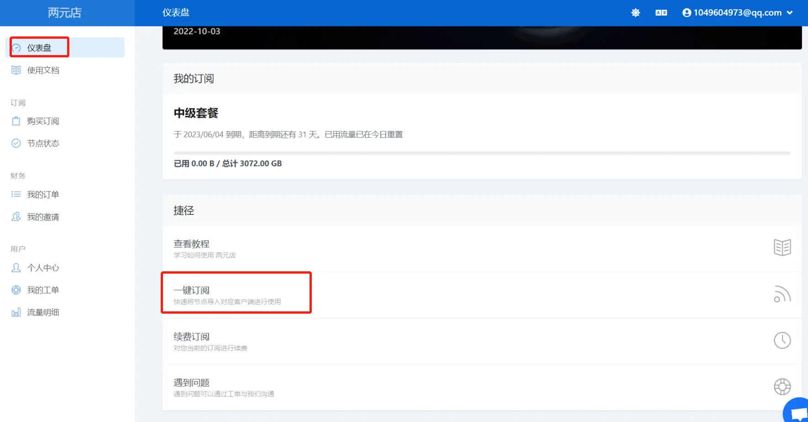

### windows

#### 软件的下载

提供的都是绿色版，下载解压即可使用。 最好去Github下载，虽然这个软件并不开源（因为第三方托管的软件可能被改过，养成好习惯）: [clash for windows __](https://github.com/Fndroid/clash_for_windows_pkg/releases/tag/0.20.22)

> 2024.10.27：Clash For Windows已下线呀，推荐 [Clash Verge __](https://github.com/clash-verge-rev/clash-verge-rev)

* * *

以上是英文版的，下面是汉化的 老样子，先贴 [Github __](https://github.com/Z-Siqi/Clash-for-Windows_Chinese/releases)

#### 订阅的导入

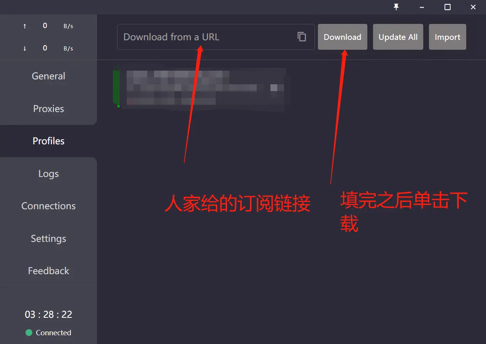

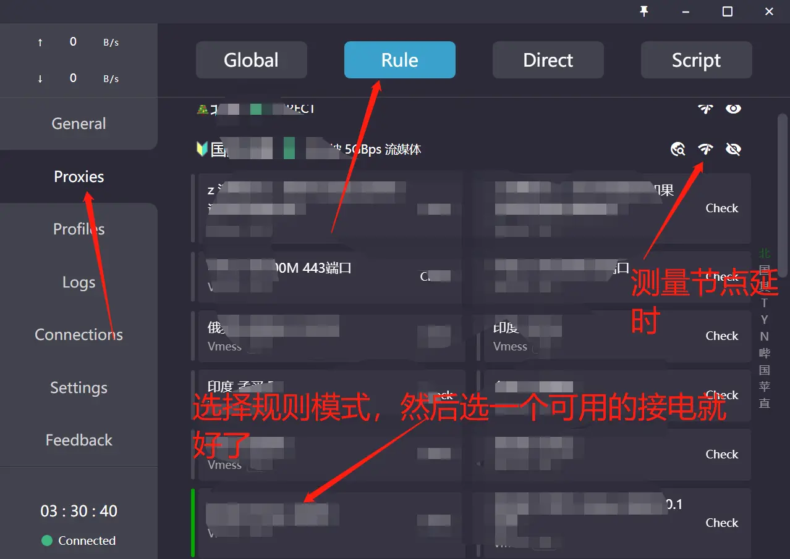

打开系统代理

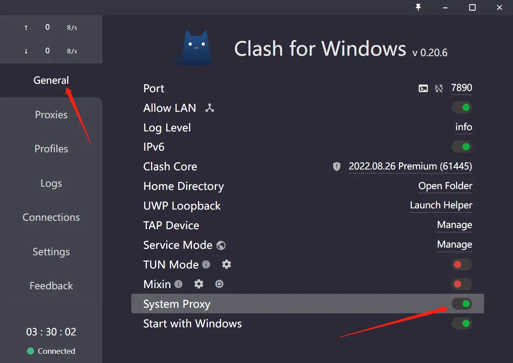

### 手机

  * 进入[网站 __](http://syhu.com.cn:8090/archives/clash.tomisme.cn)注册账号, 点击右上角三条横线(菜单), 进入购买订阅, 购买一个订阅, 价格0.01可以使用优惠码(yDE3K3ku)0元购.

  * 购买完成后, 下载并安装clash梯子软件 [点击下载安卓版 __](http://disk.syhu.com.cn/s/2QFX)(自己魔改了, 可以显示局域网IP)

  * 回到网站, 点击标题 “ttm”回到首页,下滑找到订阅, 并一键导入到clash(如果点击一键导入,没有启动其他软件,请点击上面复制Clash订阅)

  * 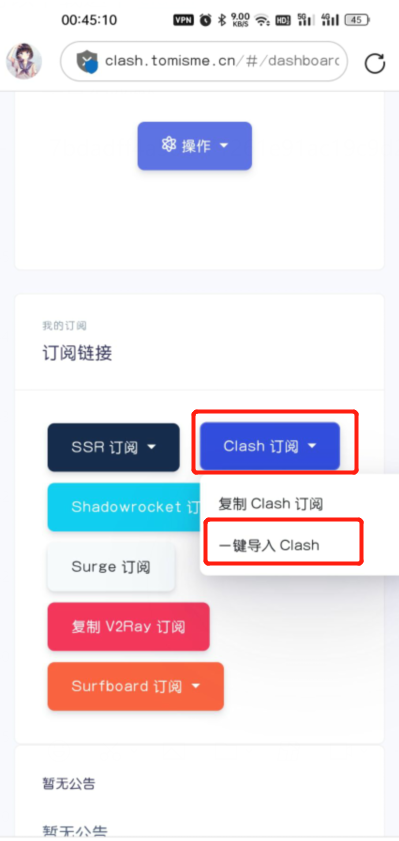

  * 如果是自动弹出的, URL处应该会自动填充了, 如果点击一键订阅没有自动弹出, 请粘贴上一步复制的链接到URL处. 单击右上角保存

  * 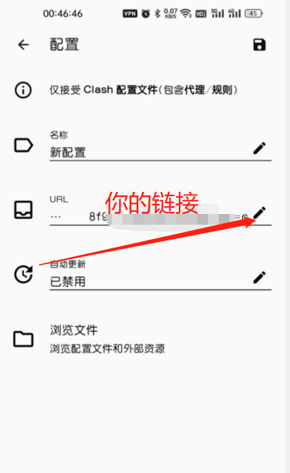

  * 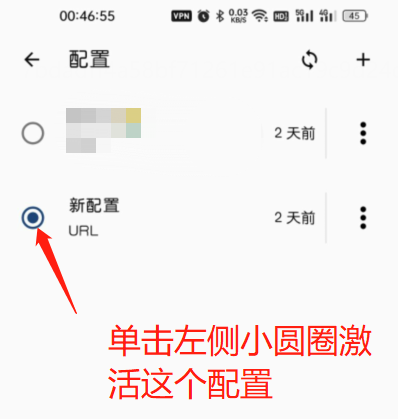

  * 如果你只有一个订阅地址，上述界面从这里进  
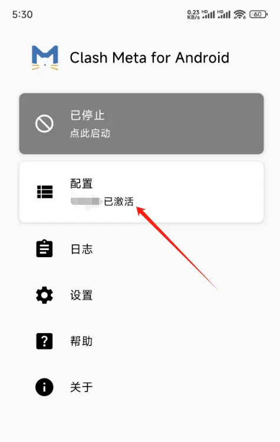

  * 单击启动,在APP请求建立VPN时选择允许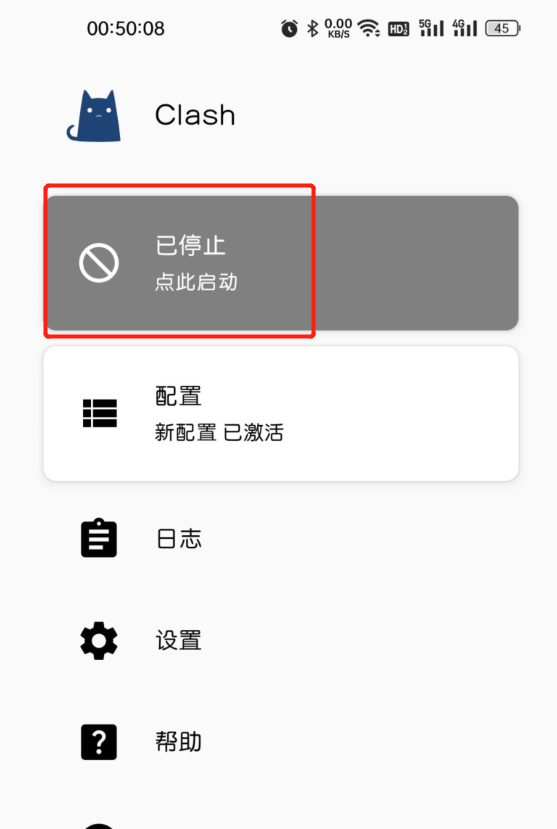

  * 至此, 网络已经走Clash了.

  * 具体的信息可以单击第二项 “代理” 来选择 网络的具体走向

    * 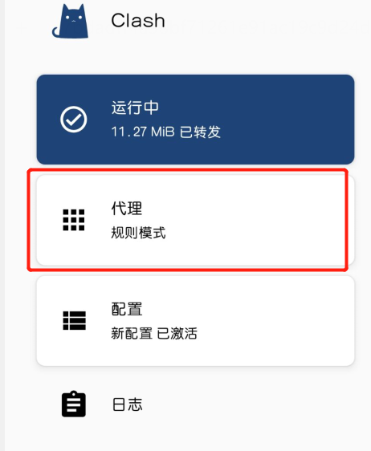
    * 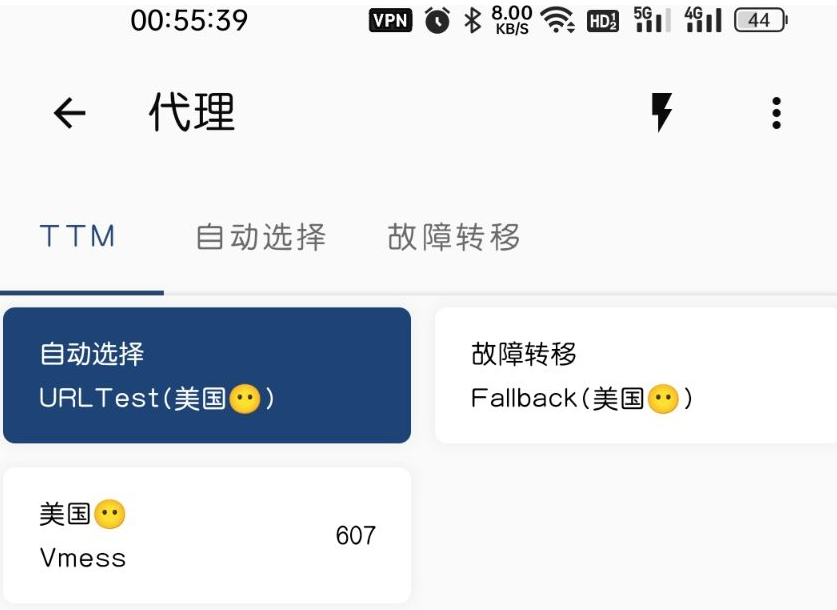
