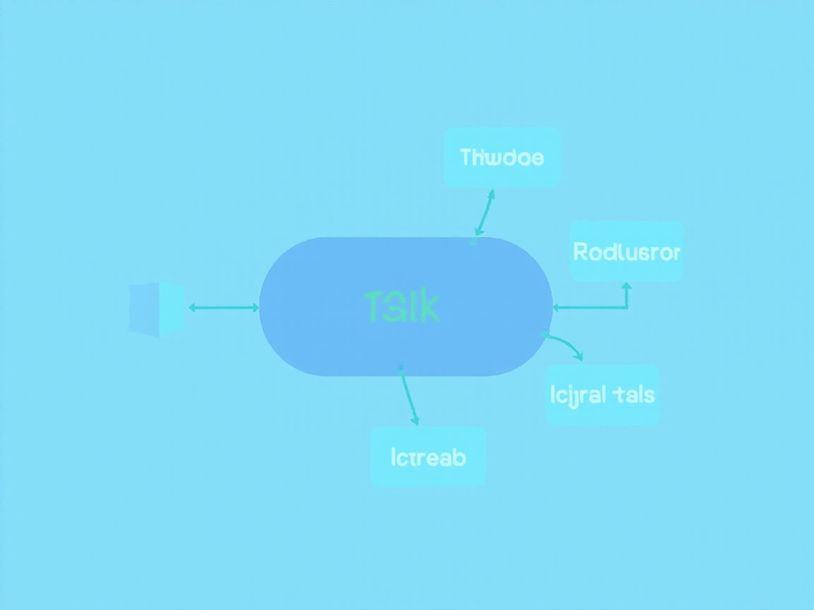
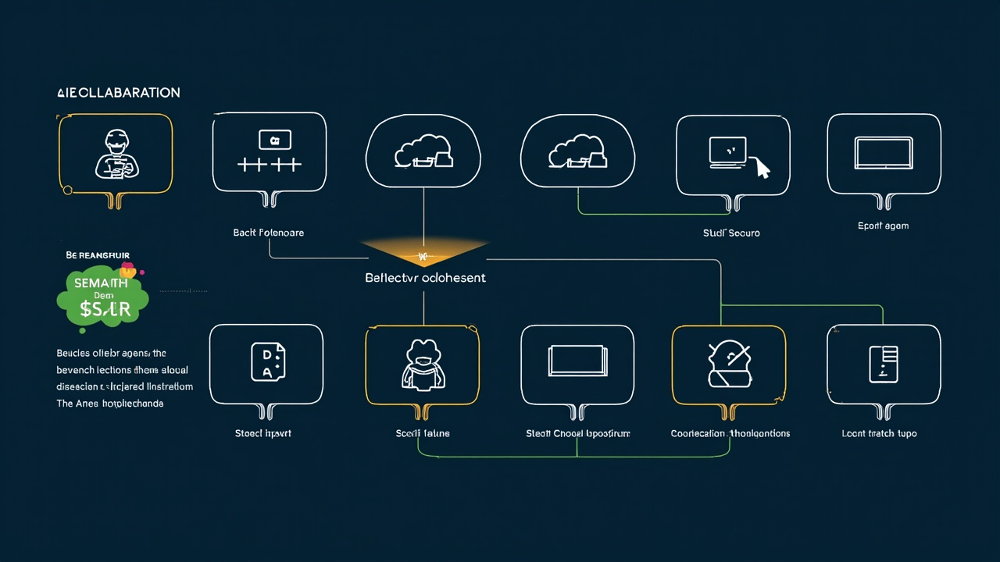

# OpenCode 最佳实践：让 AI 编程效率翻倍的秘诀

在 AI 驱动开发的新时代，OpenCode 正在重新定义我们编写代码的方式。作为一款强大的 AI 编程助手，OpenCode 凭借其自主任务执行、多代理协作、智能代码分析等特性，正在帮助越来越多的开发者提升开发效率。然而，真正发挥其潜力需要掌握正确的使用方法。

本文将深入探讨 OpenCode 的最佳实践，帮助你从「AI 工具使用者」转变为「AI 编程专家」。

---

## 一、任务分解：化繁为简的艺术

OpenCode 的核心能力是自主执行复杂任务，但前提是你需要将大目标拆解为可执行的子任务。



### 1.1 任务分解的原则

**原子性原则**：每个任务应该只做一件事。与其说「帮我重构整个认证系统」，不如拆解为：
- 分析当前认证系统的代码结构
- 设计新的认证方案
- 实现 JWT 令牌生成逻辑
- 实现令牌验证中间件
- 编写单元测试

**明确输入输出**：每个任务都应该有清晰的预期结果。

```
❌ 不好的任务描述：「优化一下性能」
✅ 好的任务描述：「分析用户查询 API 的性能瓶颈，定位响应时间超过 1s 的原因」
```

### 1.2 优先级管理

使用 todowrite 工具创建任务清单时，合理设置优先级：
- **high**：阻塞性任务、核心功能
- **medium**：次要功能、优化项
- **low**：文档、注释、代码风格等

---

## 二、充分发挥背景代理的威力

OpenCode 最强大的特性之一是后台代理机制。不要什么事情都自己做——学会「放权」。



### 2.1 探索代理（Explore Agent）

当你需要了解陌生的代码库时，不要手动翻阅几十个文件：

```typescript
call_omo_agent({
  description: "探索支付模块架构",
  prompt: "分析 src/payment 目录的架构，找出核心类和它们的依赖关系，输出 UML 类图",
  subagent_type: "explore",
  run_in_background: true
})
```

**最佳实践**：
- 启动探索代理后，立即开始处理不依赖探索结果的其他任务
- 不要重复搜索相同内容——相信代理的工作成果
- 等待系统通知，不要反复轮询

### 2.2 图书管理员代理（Librarian Agent）

需要查找文档、配置或特定模式时，Librarian 是你的好帮手：

```typescript
call_omo_agent({
  description: "查找数据库配置",
  prompt: "在整个项目中搜索数据库连接配置，对比开发环境和生产环境的差异",
  subagent_type: "librarian",
  run_in_background: true
})
```

### 2.3 预言家代理（Oracle Agent）

需要技术决策建议或代码审查时，Oracle 提供专业意见：

```typescript
call_omo_agent({
  description: "架构方案评估",
  prompt: "评估两种缓存方案：Redis vs 本地缓存。从性能、成本、一致性三个维度分析并给出建议",
  subagent_type: "oracle",
  run_in_background: true
})
```

---

## 三、提示词工程：与 AI 有效沟通

### 3.1 提供充分的上下文

**上下文不足是 AI 回答质量差的首要原因**。告诉 AI：
- 你正在处理什么文件
- 相关的代码片段
- 项目使用的技术栈
- 你已经尝试过什么方案

```
❌ 不好的提示：「这个函数报错了，帮我修一下」
✅ 好的提示：「我在 src/utils/auth.js 的第 45 行遇到了 TypeError: Cannot read property 'token' of undefined。
   这个项目使用 Node.js + Express，我已经检查了请求头确实包含 Authorization。
   请帮我分析原因并修复。」
```

### 3.2 明确约束条件

不要让 AI 猜测你的要求：

```
✅ 好的约束示例：
- 不要引入新的第三方依赖
- 保持向后兼容，现有 API 不能变
- 使用 TypeScript，确保类型安全
- 性能要求：单次调用耗时 < 10ms
- 必须包含单元测试，覆盖率 > 90%
```

### 3.3 使用示例驱动

举例子比描述更容易让 AI 理解你的意图：

```
✅ 示例驱动：
「我需要一个函数格式化日期，输入输出示例如下：
输入: new Date(2024, 0, 15) → 输出: '2024-01-15'
输入: '2024/1/15' → 输出: '2024-01-15'
输入: null → 输出: ''
请实现这个函数并处理所有边界情况。」
```

---

## 四、迭代式开发：小步快跑，持续验证

### 4.1 代码生成三步法

**第一步：生成骨架**
```
「帮我生成一个用户服务的 TypeScript 接口，包含 CRUD 方法，只需要定义类型和空实现」
```

**第二步：填充细节**
```
「现在实现 createUser 方法，需要：1) 参数校验 2) 密码加密 3) 数据库插入 4) 返回用户DTO」
```

**第三步：完善测试**
```
「为上面的 createUser 方法编写单元测试，覆盖正常情况、参数缺失、邮箱已存在三种场景」
```

### 4.2 及时验证，快速反馈

每完成一个小改动，立即运行验证：
- 使用 `lsp_diagnostics` 检查语法错误
- 运行相关的单元测试
- 手动测试核心功能

**不要积攒大量未验证的代码**——问题发现得越晚，修复成本越高。

---

## 五、代码质量：AI 也需要「Code Review」

### 5.1 使用 Review Work 技能

完成重要功能后，务必触发全面审查：

```
skill(name="review-work")
```

这将自动启动 5 个并行的审查代理：
- 目标/约束验证
- 代码质量检查
- 安全性审计
- 实际 QA 测试执行
- 上下文挖掘

### 5.2 使用 AI Slop Remover

AI 生成的代码有时会带有「AI 味道」——过度设计、不必要的抽象、冗余注释等。使用 AI Slop Remover 清理代码：

```
skill(name="ai-slop-remover")
```

### 5.3 建立质量门禁

每次提交前确保：
- ✅ LSP 诊断无错误
- ✅ 所有单元测试通过
- ✅ 类型检查通过（TypeScript 项目）
- ✅ 构建成功
- ✅ 代码经过 review-work 审查

---

## 六、上下文管理：保持专注，避免混乱

### 6.1 合理使用会话

- **单一任务单一会话**：不要在一个会话里同时做重构和写新功能
- **及时创建新会话**：当任务切换时，新开一个会话，避免上下文污染
- **使用 handoff 技能**：需要继续之前的工作时，生成上下文摘要

```
skill(name="handoff")
```

### 6.2 善用工具，减少记忆负担

不要试图记住所有东西：
- `lsp_goto_definition`：跳转到定义
- `lsp_find_references`：查找所有引用
- `lsp_symbols`：查看文件或项目符号
- `ast_grep_search`：高级代码模式搜索
- `grep`：全文本搜索

---

## 七、常见陷阱与规避

### 7.1 陷阱一：过度依赖 AI，失去判断力

**表现**：AI 说什么就信什么，从不质疑。

**规避**：
- 关键逻辑必须人工审核
- 对 AI 给出的算法复杂度、安全性等声明做验证
- 理解每一行提交的代码——你是代码的最终负责人

### 7.2 陷阱二：任务粒度太大或太小

**表现**：要么一个任务包含 10 件事，要么每个任务只有一行代码。

**黄金法则**：一个任务应该能在 15-30 分钟内完成。

### 7.3 陷阱三：不读错误信息

**表现**：遇到错误立即扔给 AI，自己不先看堆栈跟踪。

**最佳实践**：
1. 首先阅读错误信息和堆栈
2. 思考可能的原因
3. 带着你的思考去问 AI

这样你会学得更快，AI 的回答也会更准确。

---

## 八、OpenCode 使用成熟度模型

### Level 1：初学者
- 只会简单的「帮我写个函数」
- 经常得到不满意的结果
- 效率提升：0% - 20%

### Level 2：熟练使用者
- 掌握任务分解
- 会使用背景代理
- 能写出有效的提示词
- 效率提升：30% - 80%

### Level 3：专家
- 精通多代理协作
- 建立个人工作流
- 能指导 AI 完成复杂系统设计
- 效率提升：100%+

---

## 写在最后

OpenCode 不是要取代开发者，而是要解放开发者——让你从重复的编码工作中解脱出来，专注于真正重要的事情：架构设计、业务理解、用户体验。

记住：**AI 是你的合作者，不是你的替代者。** 你提供方向、判断和创造力，AI 承担繁琐的实现工作。这才是人机协作的最佳模式。

开始实践这些最佳实践吧，让 AI 成为你编程路上最得力的伙伴！

---

> 💡 你有什么 OpenCode 使用心得？欢迎在评论区分享你的最佳实践。

---
*本文由 AI 生成，如有疏漏请留言指正。*