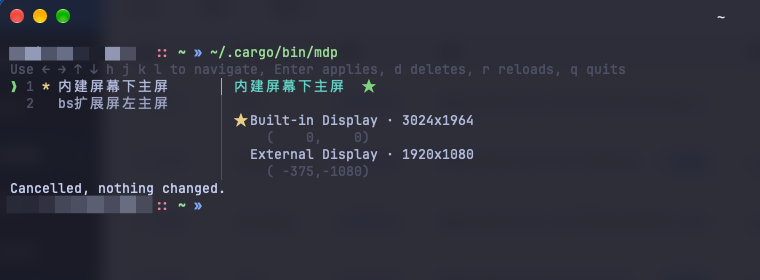

在生活工作中，有时我想直接用笔记本键盘（笔记本当主屏，扩展屏副屏，因为方便开会或者 ... 下班拽起来就走），有的时候像让扩展屏当主屏，笔记本架在旁边，用机械键盘；每次调整的时候，都是去设置一轮拖、设置主屏。

为此，我想找一个小工具，就像 tssh 链接服务器一样，一个指令选择下，就可以立即应用；

## 我要的东西很具体

我想要的其实就三条：

一是**切换要快**，快到不用进入任何设置界面，敲一行命令、回车，完事。拖鼠标这件事，在需要反复切换的场景里天然显得笨。

二是**布局要能存下来**，摆好一次存一个名字，之后按名字调用，不要每次重新想。

三是**切换主屏和切换布局是同一件事**，别让我为了换主屏额外再拖一次菜单栏。

## mdp 就是干这个的

[mdp](https://github.com/sparrowx-org/mdp) 是一个命令行小工具，专门管「每块屏放哪、哪块是主屏」这一件事。



用起来大概是这个节奏：

```bash
# 现在这套摆着挺顺眼，存一个
$ mdp store desk "大屏当主屏，笔记本竖着放右边"

# 拆了支架，改插着写代码，那就换回来
$ mdp apply laptop
```

或者干脆不记名字，敲 `mdp`，一个选择器出来，方向键移到那一条，回车。主屏是布局的一部分，所以选中哪套布局，主屏就是哪套——不用再去拖菜单栏，这一点是我最在意的。

```bash
$ mdp store desk "大屏当主屏，笔记本竖着放右边"
$ mdp store couch "笔记本主屏，外接放左边，纯看片"
$ mdp
```

平时常用的就 `mdp store`（存）、`mdp`（选）、`mdp apply <名字>`（直接切）、`mdp current`（看现在什么状态）、`mdp delete`（删）。选择器里还有两个我自己很喜欢的：`1` 到 `9` 可以直接选第几条回车，`d` 删掉选中的那条。

有个 `--session` 也挺实用：只对本次登录生效，不写进配置文件。临时把大屏让给投影仪用一下，用完回车再切回来，不留痕迹。

方案存在 `~/.config/mdp/solutions.toml`，纯文本，我把它扔进 dotfiles 了，换机器的时候直接同步过去。它认屏幕用的是每块屏的持久 UUID，不是「第几块屏」，所以插拔线、换扩展坞、重启之后都不会认错人——这块是我不敢自己写配置脚本的原因。

## 几个让我放下疑虑的地方

它不需要任何系统授权。装完直接用，不会弹辅助功能、屏幕录制的框——有些工具第一步就卡在这儿，我是被卡过的。

切换是原子的。一次应用要么全成，要么全不成，不会出现三块屏动了两块的中间状态，也不用担心手贱点到一半。

还有一点：macOS 在应用排列的时候会悄悄吃掉缝隙和重叠，所以你摆的坐标和最后落地的坐标经常对不上。mdp 干完活会把真实位置读回来，直接告诉你哪块屏没落在你想要的地方，省得我再瞪一眼屏幕确认。

## 最后

它没有界面，没有图标，没有偏好设置，就是一行 `mdp`。我不需要它替我设计布局，我需要的是在我已经知道要什么样的时候，别让我每次都重新摆一遍。

架起支架、写代码、拆下来看电视——这几个状态之间的切换，现在是我敲一行命令的事了。

```bash
brew tap sparrowx-org/tap
brew install sparrowx-org/tap/mdp
```

源码在 [sparrowx-org/mdp](https://github.com/sparrowx-org/mdp)，MIT。
