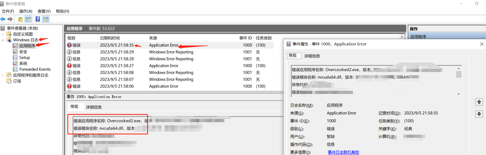
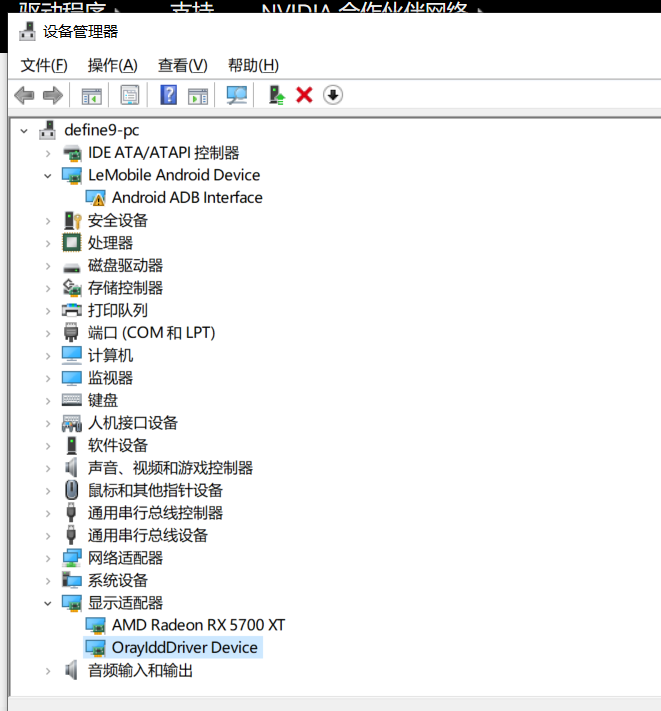

### 起因

众所周知, Epic白嫖的分手厨房2可以与steam联机(Epic正常启动, Steam需要切换成测试版进入Team17平台)

但是, 使用Steam的我, 在玩分手厨房2正式版正常, 但是切换成测试版后,在加载界面转几圈后闪退, 没有任何提示!

### 分析与修复

由于缺乏日志, 导致问题无从下手, 所以第一步还是想办法获取日志, 查看报错的地方,于是, 我搜索了 "exe闪退,查看错误日志"[使用事件查看器](https://blog.csdn.net/weixin_42222865/article/details/108801344)

显示我 分手厨房2应用错误, 错误模块是nvcuda, 可是我现在cpu和显卡都是AMD的呀, 怎么会有英伟达的cuda报错, 才发现之前用的英伟达显卡, 装了驱动, 直接换了显卡装了AMD驱动后就没管了, 所以盲猜是英伟达驱动的问题.

外加这里有一个OraylddDriver Device向日葵的虚拟显卡, 就把向日葵也卸载了.

卸载英伟达的相关驱动(可以在`控制面板\所有控制面板项\程序和功能`搜索`nvidia`)后, 无需重启, 重进游戏, 正常.

### 总结

在运行exe等可执行程序时, 如果没有错误提示, 可以使用`事件查看器`查看其错误事件, 方便下一步分析